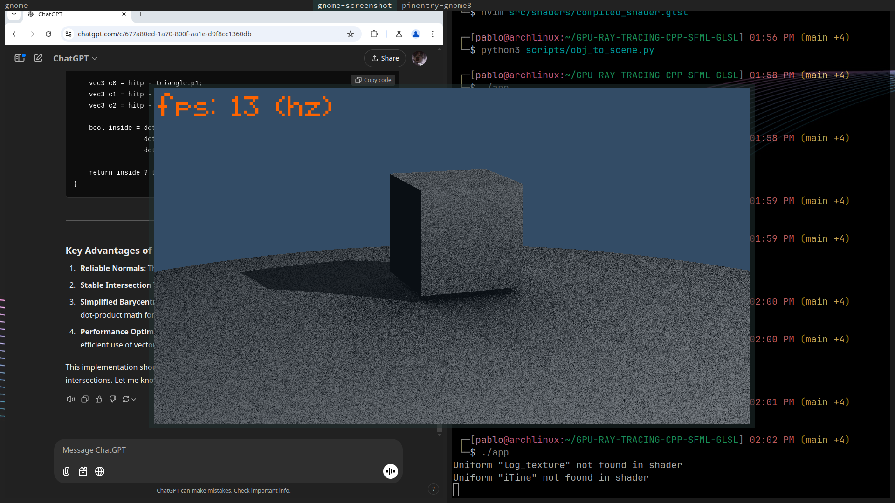
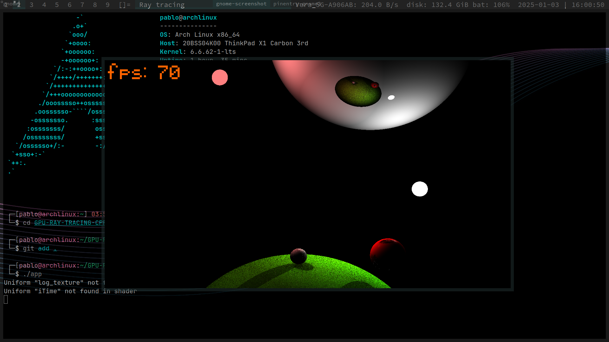
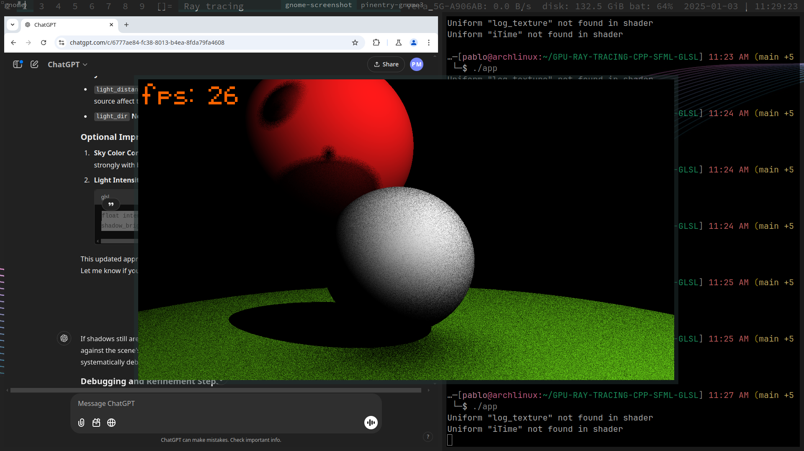
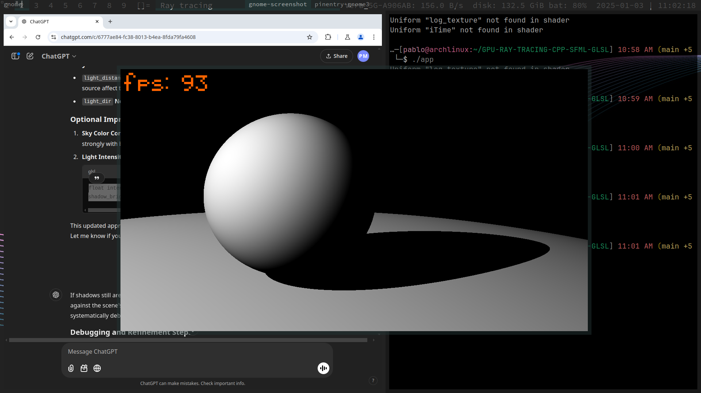
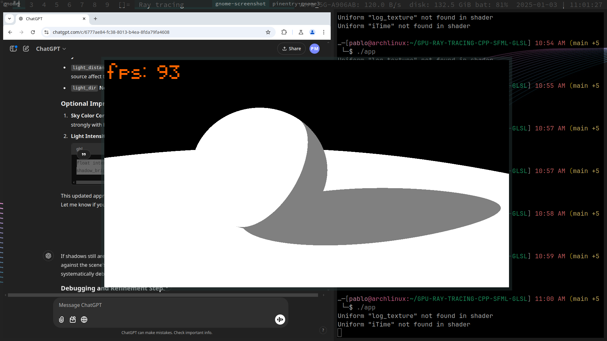

# GPU RAY TRACER

Download the dependencies at the release and drag them to the root. Then `./build` to build and run.
If you are on windows, you might replace the lib/ directory to your compatible version and place all the necessary .dlls at the root.

To import meshes just add a scene.obj file to the bin/scene/ directory and run from the root the script `python3 ./scripts/obj_to_scene.py`.

